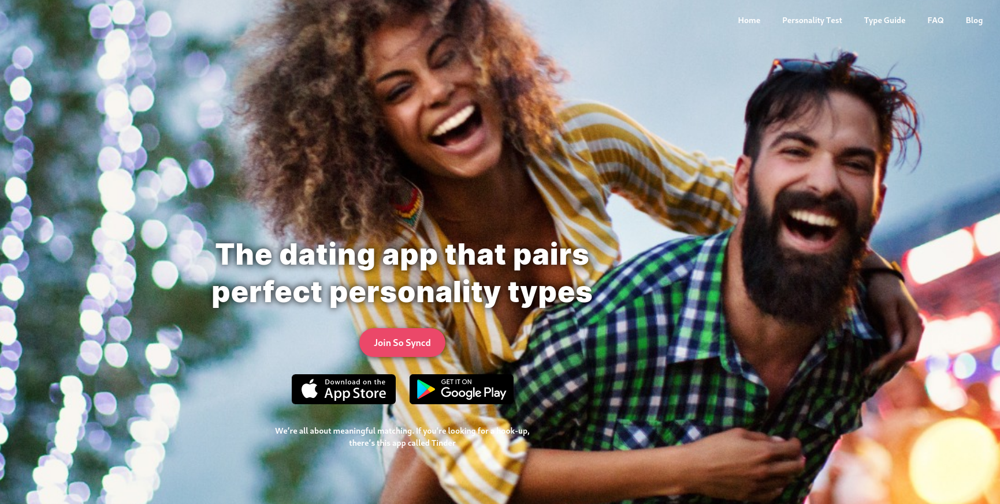

Už dávnejšie som si uvedomil jednu vec. Nielen, že ja sám som nezadaný. Ale nezadaných je aj väčšina mojich mužských kamarátov. A keď hovorím väčšina, myslím tým asi tak 90 percent. Iste, možno si poviete, že to nie je reprezentatívna vzorka, a máte pravdu. Avšak istý trend už z toho môžeme odpozorovať.

Všetci sme relatívne mladí, medzi 29-40 rokmi, vzdelaní, slušne finančne zabezpečení. (Subjektívne) žiadny z nás nie je vyslovene škaredý, zmysel pre humor nám tiež nechýba, a dokážeme sa rozprávať takmer o hocičom. Nepochybujem o tom, že pred takými pätnástimi rokmi by bola väčšina z nás zadaných, ak nie rovno ženatých. Dnes je však situácia taká, že vo vzťahu nie sme. Niektorí aspoň spomíname na to, čo bolo. Myslím si, že podobne sú na tom aj ženy. Čo sa stalo, že sme sa ako spoločnosť dostali do takejto situácie?

O dôvodoch by sa asi dali napísať celé knihy. Neustále napríklad počúvam o tom, aké je dôležité dobre sa obliekať. O tom, čo je to „dobre,“ by sa dali viesť siahodlhé debaty. Avšak problém, ktorý vidím ja, tomuto všetkému predchádza. Dnes je problém vôbec sa s niekým zoznámiť.

  <YouTube videoId="HKMmjT3rmNs" />
  <figcaption>Better Bachelor: O mužskej atraktivite</figcaption>

## Ako to bolo kedysi?
O dobe minulej by sa dalo napísať mnoho negatívneho, ale z rozprávania mám pocit, že ľudia mali k sebe bližšie. Neexistoval internet, televízia vysielala len pár hodín do dňa. Ľudia spolu komunikovali a poznali sa. No schválne, koľkí z vás poznáte aspoň svojich susedov v paneláku?

V úplných počiatkoch začali spolu muži a ženy vytvárať manželstvá z čisto praktických dôvodov. Sedliaci sa starali o dobytok, pôdu, a tým, že založili rodinu a mali deti, si zabezpečili to, že im s tým mal kto pomôcť. A takto to pokračovalo veľmi dlho. Koncept lásky, aký poznáme dnes z romantických filmov, nie je starší ako sto rokov.

Manželstvá z rozumu fungovali dlho. Na dedinách to takto fungovalo ešte aj pred takými tridsiatimi rokmi. Moja teta mi rozprávala, ako raz v nedeľu prišiel do nášho rodičovského domu otec so synom zo susednej dediny. Chlapec mal už nejakých 29 rokov, nuž patrilo sa ho oženiť. Prišli a požiadali môjho deda o ruku mojej tety. Dedo mal však svoj rozum a na tú dobu bol dosť pokrokový. Povedal: „Kveta je ešte mladá, stále študuje. Na vydaj má čas.“ Išli teda po svojom a neskôr pochodili niekde v susednej dedine.

Spoločnosť sa začala transformovať. Na manželstvá z rozumu už postupne prestal byť dôvod. Poznám však iné príbehy... Ako išli chlapci a dievčatá do táboráku, spievali si trampské piesne, a zoznamovali sa. Alebo fičali na diskotékach... Čo tým chcem povedať, je, že príležitostí niekoho stretnúť ste mali veľa. A myslím si, že aj nároky, aké sme na seba kládli, boli menšie. Na ocot tak ostali len tí, ktorí to sami chceli.

## Doba individualizmu
S pádom železnej opony a otvorením hraníc k nám nezačalo prenikať len to dobré, ale aj to zlé. Spoločnosti začal vládnuť konzum, postupne k nám prichádzali nadnárodné spoločnosti a ľudia si začali budovať kariéry. Zrazu to už nebolo o nás, ale o *MNE*. Začali z nás byť individualisti.

Som rád, že žijeme v ešte stále ako-tak slobodnej spoločnosti, v ktorej, ak ste šikovní, si dokážete plniť sny. Ale takýto spôsob života si zákonite vezme svoju daň. Naša spoločnosť sa zmenila k horšiemu. Z vlastnej skúsenosti viem, aké je dnes ťažké budovať lokálne komunity. Naše väzby sú pretrhané skrz-naskrz. A často aj v našich rodinách.

Svoj vplyv v tejto transformácii hrajú aj masmédiá a internet. V televízii neustále vidíme rôzne reality show, ktoré nám dávajú vzory. [Svadba na prvý pohľad][svadba-na-prvy-pohlad] je len jeden príkladov. Môj kamarát, Erik, spravil mimochodom [brilantnú analýzu tejto show][svadba-na-prvy-odber]. Influenceri tiež majú obrovský vplyv. Ľudia sa ich snažia napodobňovať a preberajú ich vzorce správania. Takto by sa dalo pokračovať.

A nakoniec sa tu razí kult dokonalosti. Každý je najlepší a zaslúži si pre seba to najlepšie. Zákonite tak majú mnohí z nás nafúknuté egá a nie sú schopní uspokojiť sa s niekým, kto je pod ich úroveň. Veď majú predsa naviac.

## Doba špecializácie
Vyštudoval som gymnázium. V triede sme boli chlapci a dievčatá zastúpení rovnomerne. Vtedy som však na vzťahy vôbec nemyslel. No od vysokej školy som sa začal pohybovať v prevažne mužskom kolektíve a trvá to dodnes. Vyštudoval som Telekomunikácie, v ročníku sme mali dve dievčatá na asi 70 študentov. Nastúpil som do svojej prvej firmy, tam bolo možno 10 percent dievčat (a možno preháňam). Postupne som prešiel ďalšími... No všade to bolo skoro rovnaké. Kolegov som mal vždy násobne viac ako kolegýň. A keď je výrazný pretlak mužov, ženy si zákonite môžu vyberať. Nie je to rovný boj. Druhý problém je ten, že ak aj máte vzťah na pracovisku a ten skončí, zrazu vídate svoju bývalú každý deň v práci. Aj preto som nikdy do vzťahu s kolegyňou nešiel.

Popri tom, ako sa dnes úzko špecializujeme, sa dalo čakať, že muži a ženy budú zastúpení nerovnomerne. Aj keď všade počúvame, že muži a ženy sú rovnakí, úplne to nie je pravda. Každý z nás má isté preferencie k tomu, čo ho baví. Nie je náhoda, že v školstve a zdravotníctve je tak veľa žien... rovnako ako nie je náhoda, že väčšina programátorov je mužov. Tým nechcem povedať, že ženy toto povolanie vykonávať nemôžu. Môžu a aj to robia, ale tak ako ja nepôjdem robiť sestričku, lebo mi to nie je blízke, väčšina žien má tendenciu robiť povolanie, kde prichádza do kontaktu s ľuďmi. Takže vznikajú pracovné prostredia s výrazným nepomerom mužov a žien.

## Doba #METOO
Sexuálne obťažovanie je reálne. Ale to, čo sa z toho pojmu za tie roky stalo, nabralo obludné rozmery. V Spojených štátoch amerických to zašlo až tak ďaleko, že [muži sa boja mentorovať ženy][men-women-mentoring], pretože stačí jedno krivé slovo, a majú po kariére. Víťazom nie je nikto. Iba porazení. *#METOO* hnutie veci dohnalo až do takého extrému, že dnes už dokážete zničiť kariéru aj bez dôkazov. A ak sa aj neskôr ukáže, že si protistrana veci vymyslela, nič to nemení. Narážam napríklad na krivé obvinenia na adresu Johnyho Deppa.

Kedysi ste mohli slečnu osloviť len tak na ulici a mohlo z toho vzniknúť niečo pekné. Dnes neviete, na čom ste. A preto sme od toho ako spoločnosť ustúpili. Pritom je to prirodzené.

  <YouTube videoId="7se674Xue3U" />
  <figcaption>Príbeh Johnyho Deppa</figcaption>

## Doba feminizmu
Spočiatku začal feminizmus, teda boj za práva žien, nevinne. Ženy chceli právom svoju rovnoprávnosť s mužmi. Aj tu sme však zašli priďaleko. Dnes už je doba, keď si toto hnutie uzurpuje práva mužov. Mnohé firmy začínajú zavádzať kvóty na vyvážený podiel mužov a žien. Dosadzujú ženy na vysoké riadiace pozície alebo do správnej rady, len aby mali zastúpené ženy.

*Len drobná odbočka. Ja som zástanca [meritokracie][meritocracy], čiže som za to dať rovnakú príležitosť všetkým a nech sa ukáže, kto má na danú pozíciu najväčší talent a predpoklady. Neriešim, či sú to muži, ženy, afroameričania, belosi, aziati.*

Reklamy zosmiešňujú mužov a hovoria o akejsi „toxickej maskulinite.“ A takto ešte viac polarizujú spoločnosť. Z pomeru lajkov a dislajkov vo videu nižšie je to zrejmé.

  <YouTube videoId="koPmuEyP3a0" />
  <figcaption>We Believe: The Best Men Can Be | Gillette (Short Film)</figcaption>

Mnohé štátne inštitúcie protežujú ženy — napríklad v USA sú deti takmer v [90 percentách prípadov][child-custody] pri rozvode zverené do opatrovníctva matky. Čerešničkou na torte sú školy, predovšetkým univerzity. Pozakladali rôzne pochybné odbory, ako genderové štúdie, ktorých absolventi šíria túto, dovolím si povedať, už pokrivenú ideológiu ďalej. Mnohí absolventi končia ako bloggeri či novinári a píšu články, ktoré čítajú obrovské masy ľudí. Alebo píšu scenáre do filmov a seriálov...

  <YouTube videoId="bnkm9g1pGGQ" />
  <figcaption>Nový James Bond bojuje s „toxickou maskulinitou“</figcaption>

  <YouTube videoId="cweP4_zHd0Q" />
  <figcaption>A nový Indiana Jones tiež.</figcaption>

Bežní ľudia si už tiež všimli, že tie filmy a seriály istú agendu pretláčajú. Ale neuvedomujú si, že ich to ovplyvňuje. Aj keď možno len podvedome. Ľudia preberajú vzorce správania, ktoré vidia okolo seba.

Aj keď tento odstavec vyzerá trochu pesimisticky, skúsim ho trochu vyvážiť. Tieto extrémy vnímam predovšetkým v USA. Myslím si, že aj keď u nás tieto trendy postupne prichádzajú, fungujeme ešte stále relatívne v pohode. Stále je u nás, na Slovensku, jednoduchšie stretnúť niekoho, kto má zdravý pohľad na svet. Keby som to takto nevidel, nepíšem tento text.

## Doba užívania si života
Kým v minulosti bolo bežné zakladať rodiny už po dvadsiatke, dnes s tým akosi všetci čakajú. Veď treba si vraj ten život najprv užiť. Nezáväzné vzťahy, veľa cestovania, [Erasmus][erasmus], zábava. Ja takto nastavený nie som. Myslím si, že viem viesť dobrý život aj s rodinou po boku. Všetko je len otázka priorít a plánovania. Verím, že to takto nevidím len ja, ale mám pocit, že som v menšine.

## Kde niekoho stretnúť?
Táboráky už nemáme, diskotéky (asi) tiež nie. Minule známi kamarátovi povedali, že nech ide na diskotéku, tam niekoho stretne... Aj on mi potvrdil, že dnes je to iné.

Na diskotéky som nechodil, zato v hudobných kluboch som bol niekedy aj dvakrát do týždňa. Hudba je tam dnes tak nahlas, že som si musel kúpiť štuple do uší pre muzikantov. Nezničím si predsa sluch. Takže prvý problém je, že v tom hluku sa nedá rozprávať. Druhý problém je, že dnes sa do klubov ľudia nechodia zoznamovať. Častokrát tam chodia páry. Občas skupinky kamarátov/kamarátiek, ale na zoznamovanie na koncerte nikto z nich nemyslí.

### Hľadanie podľa spoločných záujmov
Zoznamke som sa doteraz vyhýbal. Nižšie vám poviem prečo... Páči sa mi, že sa ľudia spoznajú len tak, organicky. Stretnú sa, spoznajú, zaľúbia... Uvedomujem si, že pre dlhodobý vzťah je dôležité mať aj spoločné záujmy. Skúšal som to teda takto: ak hľadám slečnu, čo má podobné záujmy ako ja, bude chodiť na podobné miesta ako ja. Takže ak ma baví varenie, pôjdem na kurz varenia, a je možné, že tam stretnem aj nejakú slečnu. Tento prístup funguje. Dôkazom je, že som v Toastmasters spoznal svoju bývalú priateľku, Nely. Avšak ak vás zaujímajú príliš okrajové koníčky, aj tých ľudí, ktorých takto spoznáte, je relatívne málo.

### Online zoznamka
Predstavte si nekonečný zoznam príspevkov na Facebooku. Takto nejako vnímam zoznamku. Veľká databáza ľudí a prirodzená tendencia byť prieberčivý a hľadať stále lepších a lepších. Ak máte iné skúsenosti, rád sa o nich dozviem. Ale príde mi to, že prvotný filter na zoznamke je fotka. Takže bez toho, aby sme si o človeku niečo vôbec stihli prečítať, hľadáme ďalej. Platí to pre mužov aj ženy. Zašlo to tak ďaleko, že dnes nájdete články o tom, ako sa vyfotiť na zoznamku, aby ste zaujali. Pozlátko, nie obsah. Zároveň hľadáte doslova ihlu v kope ihiel. Niektoré zoznamky síce píšu, že dohadzujú ľudí dokopy podľa akéhosi testu kompatibility, ale v praxi to nie vždy funguje. Kamarát spomínal, ako mu [jedna platená zoznamka][partner-na-urovni] ponúkala len podivné zhody a keď mal filter pre ženy z okolia Prešova a Košíc, bolo tam tých žien vtedy málo.

  
  <figcaption>Online zoznamka So Syncd</figcaption>

Ja mám podobnú skúsenosť. Registroval som sa v zoznamke [So Syncd][so-syncd]. Párujú ľudí podľa typu osobnosti. Povedal som si, že prečo nie? Dávalo mi to zmysel. Akurát, že v celej Európe som bol asi jediný klient. Núkalo mi to slečný z Kanady a USA. Nápad dobrý, ale bez ľudí je to oničom.

### Rande naslepo
Nedávno vyskúšal môj bratranec rande naslepo. Povedal, že to bola zaujímavá skúsenosť. Dopredu netušíš, čo ťa čaká, či si budete rozumieť a tak... Asi je to však len o zvyku. Aj vďaka Toastmasters som sa s ľuďmi ostrieľal už natoľko, že by som si na to trúfol tiež. Len netuším, ako na to. Hlavne teraz, keď je lockdown.

## Vzťahoví koučovia
Túto dnešnú dobu už len podčiarkuje nástup rôznych koučov, ktorí radia, ako sa zoznámiť. A tiež koučov, ktorí radia mužom, ako vôbec osloviť ženy. To sme to dopracovali... Vznikajú aj knihy, napríklad [o tom, ako pristupovať k osloveniu žien][the-game] ako k hre. To preto, aby sme nebrali odmietnutie príliš osobne. Kedysi sme žiadnych koučov nepotrebovali, lebo nikto nebral vzťahy tak vážne a nikto nemal také šialene vysoké, niekedy až nereálne nároky.

## COVID-19 a nekončiaci lockdown
Ak som si pred covidom myslel, že zoznámiť sa je ťažké, teraz je to len horšie. Ľudia zaliezli do svojich domovov. Keď chodíme s kamarátmi po vonku, častokrát si pripadáme ako na nejakom opustenom ostrove. Okrem zopár bežcov a psíčkarov nikde nikto. Ostáva len dúfať, že sa veci aspoň trochu priblížia stavu spred roka. Dôsledky sú už teraz strašné. Ľudia trpia depresiami a stúpa odber liekov na psychiku.

  <YouTube videoId="DXg9sH7f_u8" />
  <figcaption>Pomôžme rúškaristom a respirátoristom liečiť STRACH v duši</figcaption>

## Dôsledky
Kým doteraz som popisoval, ako vnímam problém nadväzovania vzťahov, teraz by som rád spomenul, aké to má dôsledky. Predstavte si nožnice, ktoré sa roztvárajú, stále viac a viac. Na jednom konci sú ženy, na druhom muži. Vzďaľujeme sa.

Dôsledky už začíname vidieť. Na Slovensku za uplynulý rok [zomrelo viac ľudí ako sa narodilo][sk-natality-mortality]. V západnom svete je to podobné. A v dôsledku tejto rozpoltenosti začínajú vznikať aj nové ideové smery. Jeden vám teraz predstavím.

## Muži, ktorí si idú svojou cestou ([MGTOW][mgtow])
V niektorých článkoch som zachytil, že ide o hnutie. Niečo však o tom viem. Podľa mňa ide o ideológiu. Podstata je takáto: muži si začínajú uvedomovať, akú nerovnú hru by mali hrať. [80 percent žien túži po horných 20 percentách mužov][80-20-rule], mnohé ženy majú nereálne predstavy o partnerovi. Aby si našli partnerky, potrebujú dobre vyzerať, dobre zarábať, dobre sa obliekať, mať zaujímavé koníčky... A ak budú mať šťastie, nájdu si partnerku. Ľudia z MGTOW komunity sú veľmi dobrí v štatistikách a v zdôvodňovaní, ako niečo (ne)funguje. Vedia, že ak si chcú nájsť partnerku, musia pre to spraviť relatívne dosť. A oprávnene si kladú otázku, čo tým získajú... Sex? Priateľstvo? Spoločnosť? Došlo im, že väčšinu svojich potrieb si dokážu zabezpečiť aj bez partnerky a žiť šťastný život. Namiesto ženy si nájdu priateľov, koníčky, kúpia si psa... Stačí im oveľa menej peňazí, lebo žijú sami. Pracujú teda oveľa menej, sú finančne zabezpečení, a nie sú odkázaní robiť prácu, ktorá ich nebaví. S manželkou a deťmi to ide o dosť ťažšie, aj keď kde je vôľa, tam je cesta.

Mnohí muži, ktorí skončili v MGTOW, sú rozvedení. Stratili všetko. Ženu, deti, dom, financie. A uchyľujú sa k tomuto riešeniu. Chcú si len žiť svoj život.

Osobne vnímam MGTOW ako dôsledok toho, čo sa deje, nie príčinu. Tí muži boli k tomu dotlačení spoločnosťou. Nemyslím si, že je to úplne zdravý prístup. A viete čo je zaujímavé? Ani oni. Vedia, že pre spoločnosť je MGTOW ako celok škodné, ale pre nich je podstatné, aby si užili svoj život najlepšie ako vedia. A v tomto sa s nimi zhodnem. Nie všetci MGTOW muži sa odstrihli od spoločnosti. Niektorí ešte randia, ale žiadny z nich nechce vstupovať do dlhodobého vzťahu, prípadne manželstva.

Čo je mi však sympatické, je, že si ako svoj cieľ nekladú robiť všetko preto, aby našli partnerku. Radšej využijú čas na to, aby zlepšili samých seba. Cvičia, veľa čítajú, budujú kariéry, podnikajú, zdieľajú svoje myšlienky s ostatnými, napríklad cez YouTube a podobne. A v tomto sa s nimi zhodnem aj ja. Nedávno som prehodnocoval, ako si predstavujem svoj vzťah v budúcnosti. Začal som raziť presvedčenie, že človek by mal pevne stáť na viacerých nohách. Pokiaľ žijú vo vzťahu len muž, žena a prípadne deti, ak sa vzťah pokazí, obaja prechádzajú obrovskou traumou, pretože stratili jeden z ich hlavných pilierov. Ja dlhodobo fungujem tak, že mám množstvo priateľov, veľkú rodinu a hlavne množstvo aktivít. Mám svoju cestu, svoju víziu, a tej venujem svoje snaženie. Ak tým zaujmem nejakú slečnu a rada ju so mnou bude zdieľať, poteším sa. Prirovnajme to ku vlaku... Ja som vlak, smerujem k svojim cieľom. Ak nájdem priateľku, ktorú tieto ciele zaujmú, nastúpi do môjho vlaku. A keby sa ukázalo, že nenachádzame zhodu, z vlaku neskôr vystúpi. Ale ja mám stále svoj cieľ, svoju víziu. Keby som ciele zmenil a podriadil niekomu inému, pri rozchode by sa mi zrútil svet.

Myslím si, že je správne, ak ľudia majú svoje vízie. A verím, že dokážem nájsť niekoho, kto ich bude so mnou zdieľať. Toto nemá byť o kompromisoch. Hľadáte predsa vzťah na celý život. V tomto si musíte rozumieť.

## Cat Ladies
Na opačnom protipóle MGTOW sú ženy, ktoré dostali prezývku „cat ladies.“ Je to preto, že spočiatku si užívali život, a niekedy, keď sa už blížili k štyridsiatke, si zmysleli, že by bolo fajn sa aj usadiť. V takomto veku je však ťažké nájsť si partnera, hlavne pre ženu. Ovplyvnené tým, čo som popísal vyššie, majú niektoré z nich aj v tomto veku stále privysoké nároky na svojich partnerov. V dôsledku toho žijú samé, alebo so svojimi mačkami. Preto to pomenovanie.

## Čo s tým?
Žiadne extrémy nie sú dobré. Žiaľ, dnes ich vidíme všade, kam sa pozrieme. Globálne riešenie tohto problému v tejto chvíli nevidím. Na to som príliš maličký. A čo sa mňa týka, skúsim využiť poznatky, ktoré mám, a aspoň sa pokúsiť nájsť niekoho, s kým si budem rozumieť a s kým založím rodinu. Uvedomujem si, že šťastie vychádza predovšetkým z môjho vnútra, ale žena vie priniesť niečo nové do môjho sveta. A verím, že ja jej tiež. Idú ťažké časy a páčilo by sa mi prechádzať nimi s niekým. Avšak keď sa tak nestane, život ide ďalej. Nateraz skúsim mať oči otvorené a uvidím, či nájdem nejaké príležitosti nájsť vzťah. A aj naďalej budem pracovať na sebe a na svojej vízii. To je to, čo ma definuje, čo ma napĺňa, a predovšetkým, čo ma baví.

Aj keď tento text mohol vyznieť trochu pesimisticky, nezabúdajme, že budúcnosť stále nie je napísaná. Všetko vieme stále zmeniť. Začnime napríklad tým, že prehodnotíme naše vlastné správanie a hodnoty. Ja už v tom mám jasno a viem, že som k tomu zopár blízkych inšpiroval. Rád s vami o tom budem viesť debatu a viem vás aj nasmerovať, ak o to budete stáť.

Prajem nám žiarivú budúcnosť s niekým, s kým si budeme rozumieť. Život máme len jeden.

[//]: # (Used references)
[svadba-na-prvy-pohlad]: https://videoarchiv.markiza.sk/video/svadba-na-prvy-pohlad/
[svadba-na-prvy-odber]: http://konprirody.info:8756/0071SvadbaNaPrvyOdber.html
[child-custody]: https://www.cor-law.com/blog/women-get-child-custody-90-percent-cases-isnt-gender-discrimination/
[erasmus]: https://ec.europa.eu/programmes/erasmus-plus/node_en
[partner-na-urovni]: https://www.partnernaurovni.sk/
[so-syncd]: https://www.sosyncd.com/
[the-game]: https://www.amazon.com/The-Game-Neil-Strauss-audiobook/dp/B002DN9I1Y/ref=sr_1_1?crid=1WUGLXHILHUWY&dchild=1&keywords=the+game+neil+strauss&qid=1619898866&sprefix=the+game%2Caps%2C298&sr=8-1
[sk-natality-mortality]: https://spravy.pravda.sk/domace/clanok/584561-umrtnost-po-17-rokoch-aj-pre-covid-19-prevysila-porodnost/
[mgtow]: https://en.wikipedia.org/wiki/Men_Going_Their_Own_Way
[80-20-rule]: https://therationalmale.com/tag/8020-rule/
[men-women-mentoring]: https://www.nytimes.com/2019/01/29/us/metoo-men-women-mentors.html
[meritocracy]: https://en.wikipedia.org/wiki/Meritocracy